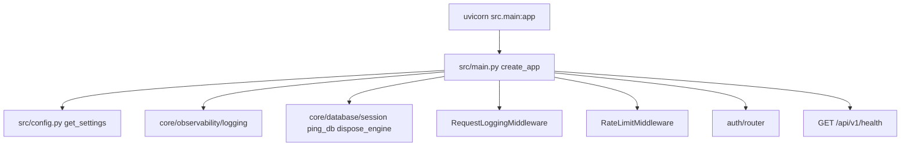
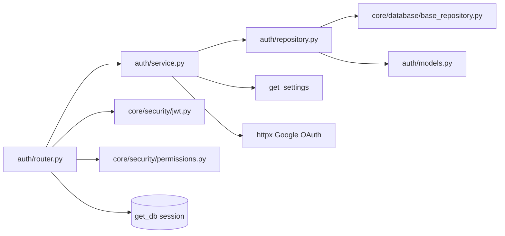
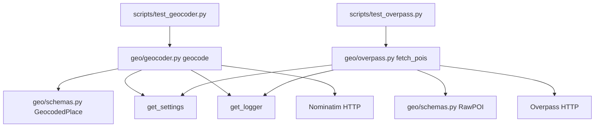

# 04 — Imports & wiring

**Up:** [Developer Manual index](../app/documentation.md) · **Prev:** [03-module-map](03-module-map.md)

Focus: **who imports whom** for code that exists today. Stub packages are omitted on purpose.

---

## App startup & HTTP

| From | Imports | Why |
|------|---------|-----|
| `src/main.py` | `get_settings` | Env / app metadata |
| `src/main.py` | `configure_logging`, `get_logger` | Lifespan logging |
| `src/main.py` | `ping_db`, `dispose_engine` | DB health + shutdown |
| `src/main.py` | `WandrError`, `ApiResponse`, `ErrorResponse` | Global handlers |
| `src/main.py` | `RequestLoggingMiddleware`, `RateLimitMiddleware` | Cross-cutting |
| `src/main.py` | `auth.router` | Mount auth routes |

---

## Auth request chain

| From | Imports | Why |
|------|---------|-----|
| `auth/router.py` | `AuthService` | Business operations |
| `auth/router.py` | `get_db` | Session dependency |
| `auth/router.py` | `optional_auth`, `create_access_token` | Cookie/Bearer + JWT issue |
| `auth/router.py` | `ApiResponse`, schemas, exceptions | HTTP envelope |
| `auth/service.py` | `UserRepository` | Persistence |
| `auth/service.py` | `get_settings`, httpx, tenacity | Google token/userinfo |
| `auth/repository.py` | `User`, `BaseRepository` | Soft-delete CRUD |
| `auth/models.py` | `Base` + mixins | ORM table |
| `auth/exceptions.py` | `WandrError` subclasses | Domain errors |

**Do not:** import `UserRepository` from the router. Router → Service → Repository only.

---

## Geo gateways

| From | Imports | Why |
|------|---------|-----|
| `geo/geocoder.py` | `get_settings`, `get_logger`, `GeocodedPlace` | Config, logs, DTO |
| `geo/overpass.py` | `get_settings`, `get_logger`, `RawPOI` | Config, logs, DTO |
| `geo/schemas.py` | pydantic only | No FastAPI / SQLAlchemy |
| Future seed / places | will call `geocode` / `fetch_pois` only | Never raw OverpassQL outside `geo/` |

`geo/osrm.py` is a **stub** — nothing should import it yet.

---

## Database & models

| From | Imports | Why |
|------|---------|-----|
| Domain `*/models.py` | `src.core.database.base` mixins | Shared UUID / timestamps / soft-delete |
| `alembic/env.py` | All model modules | Autogenerate / metadata |
| Repositories | models + `BaseRepository` | Typed CRUD |
| Routers needing DB | `get_db` only (via service today) | Session scope |

---

## Security helpers

| From | Imports | Why |
|------|---------|-----|
| `permissions.py` | `jwt.verify_token` | Parse Bearer / cookie |
| Routers | `require_auth` / `optional_auth` | FastAPI dependencies |
| Auth callback | `create_access_token` | Issue `wandr_token` |

---

## What is *not* wired yet

No import edges from `main.py` into destinations/places/trips routers — those packages are models-only or stubs. Planner / search / travel_engine have no callers.

Next: [05 — How to change](05-how-to-change.md)
