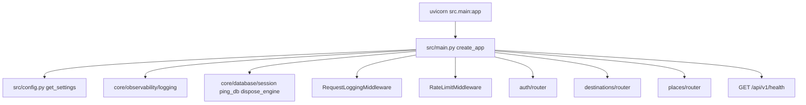
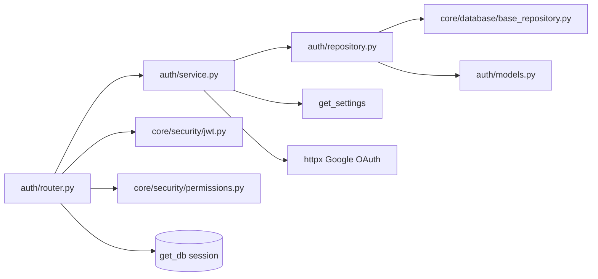
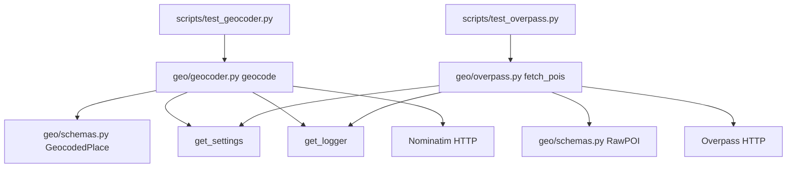
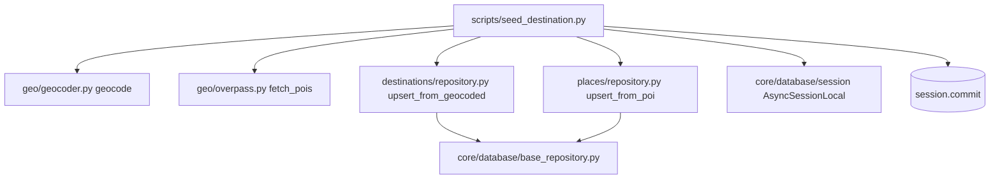
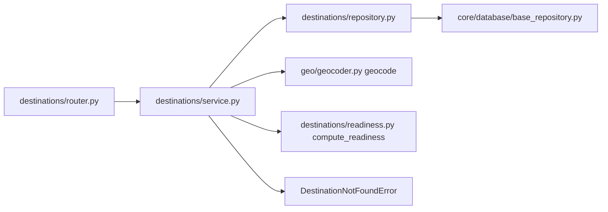
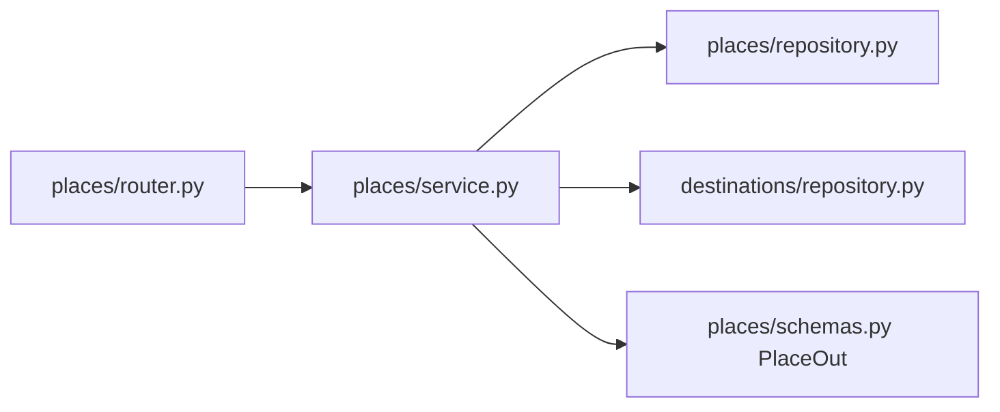

# 04 — Imports & wiring

**Up:** [Developer Manual index](../app/documentation.md) · **Prev:** [03-module-map](03-module-map.md)

Focus: **who imports whom** for code that exists today. Stub packages are omitted on purpose.

---

## App startup & HTTP

| From | Imports | Why |
|------|---------|-----|
| `src/main.py` | `get_settings` | Env / app metadata |
| `src/main.py` | `configure_logging`, `get_logger` | Lifespan logging |
| `src/main.py` | `ping_db`, `dispose_engine` | DB health + shutdown |
| `src/main.py` | `WandrError`, `ApiResponse`, `ErrorResponse` | Global handlers |
| `src/main.py` | `RequestLoggingMiddleware`, `RateLimitMiddleware` | Cross-cutting |
| `src/main.py` | `auth.router`, `destinations.router`, `places.router` | Mount HTTP routes |

---

## Auth request chain

| From | Imports | Why |
|------|---------|-----|
| `auth/router.py` | `AuthService` | Business operations |
| `auth/router.py` | `get_db` | Session dependency |
| `auth/router.py` | `optional_auth`, `create_access_token` | Cookie/Bearer + JWT issue |
| `auth/router.py` | `ApiResponse`, schemas, exceptions | HTTP envelope |
| `auth/service.py` | `UserRepository` | Persistence |
| `auth/service.py` | `get_settings`, httpx, tenacity | Google token/userinfo |
| `auth/repository.py` | `User`, `BaseRepository` | Soft-delete CRUD |
| `auth/models.py` | `Base` + mixins | ORM table |
| `auth/exceptions.py` | `WandrError` subclasses | Domain errors |

**Do not:** import `UserRepository` from the router. Router → Service → Repository only.

---

## Geo gateways

| From | Imports | Why |
|------|---------|-----|
| `geo/geocoder.py` | `get_settings`, `get_logger`, `GeocodedPlace` | Config, logs, DTO |
| `geo/overpass.py` | `get_settings`, `get_logger`, `RawPOI` | Config, logs, DTO |
| `geo/schemas.py` | pydantic only | No FastAPI / SQLAlchemy |
| `scripts/seed_destination.py`, `destinations/service.py` | `geocode` / `fetch_pois` only | Never raw OverpassQL or Nominatim URLs outside `geo/` |
| Callers needing driving times | `geo/osrm.get_route` | Haversine × 1.4 fallback; never raises httpx |

---

## Seed pipeline (P2.4)

| From | Imports | Why |
|------|---------|-----|
| `scripts/seed_destination.py` | `geocode`, `fetch_pois` | Only sanctioned outbound geo path |
| `scripts/seed_destination.py` | `DestinationRepository`, `PlaceRepository` | Atomic upserts (`ON CONFLICT`) |
| `scripts/seed_destination.py` | `AsyncSessionLocal`, `dispose_engine` | Owns the session; scripts commit |
| `scripts/seed_destination.py` | `configure_logging`, `get_logger` | `seed.poi_failed` / `seed.no_pois` warnings |

Contract worth knowing before you touch it: each POI upsert runs inside `session.begin_nested()`
(a SAVEPOINT), so one failing row is rolled back and skipped while the rest of the batch and the
final commit still succeed. A bare `try/except` would leave the Postgres transaction aborted.

`seed_places(session, destination_id, pois) -> int` and
`seed_destination_into(session, name, radius_km)` are importable on purpose —
pytest drives failure boundaries without the CLI owning the session. The CLI
wrapper (`seed_destination`) still opens `AsyncSessionLocal`, commits, and
returns exit codes.

---

## Destination search + readiness (P2.6c / 2.8)

DB hit returns early and never calls Nominatim; only a miss geocodes, upserts atomically, and
commits. Readiness is pure math over denormalized counters — P2 always passes `search_available=False`.

---

## Places HTTP (P2.7b)

List verifies the destination exists first (404, never empty page). Router never touches repositories.

---

## Database & models

| From | Imports | Why |
|------|---------|-----|
| Domain `*/models.py` | `src.core.database.base` mixins | Shared UUID / timestamps / soft-delete |
| `alembic/env.py` | All model modules | Autogenerate / metadata |
| Repositories | models + `BaseRepository` | Typed CRUD |
| Routers needing DB | `get_db` only (via service today) | Session scope |

---

## Security helpers

| From | Imports | Why |
|------|---------|-----|
| `permissions.py` | `jwt.verify_token` | Parse Bearer / cookie |
| Routers | `require_auth` / `optional_auth` | FastAPI dependencies |
| Auth callback | `create_access_token` | Issue `wandr_token` |

---

## What is *not* wired yet

Planner / search / travel_engine have no callers. Trip/evaluation packages are models-only.

## P2 verification wiring

| Path | Role |
|------|------|
| `tests/geo/` | Mocked Nominatim / Overpass / OSRM gateway tests |
| `tests/destinations/`, `tests/places/` | Readiness, repository, and HTTP router tests |
| `tests/scripts/test_seed_destination.py` | Seed failure boundaries via `seed_destination_into` / `seed_places` |
| `scripts/test_p2_smoke.py` | Live fail-fast proof (network + commits to the development database) |

Next: [05 — How to change](05-how-to-change.md)
