# 04 — Imports & wiring

**Up:** [Developer Manual index](../app/documentation.md) · **Prev:** [03-module-map](03-module-map.md)

Focus: **who imports whom** for code that exists today. Stub packages are omitted on purpose.

---

## App startup & HTTP

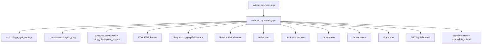

| From | Imports | Why |
|------|---------|-----|
| `src/main.py` | `get_settings` | Env / app metadata / CORS origins |
| `src/main.py` | `configure_logging`, `get_logger` | Lifespan logging |
| `src/main.py` | `ping_db`, `dispose_engine` | DB health + shutdown |
| `src/main.py` | `ensure_places_collection`, embedding load | Qdrant + MiniLM lifespan |
| `src/main.py` | `WandrError`, `ApiResponse`, `ErrorResponse` | Global handlers |
| `src/main.py` | `CORSMiddleware`, `RequestLoggingMiddleware`, `RateLimitMiddleware` | Cross-cutting |
| `src/main.py` | `auth.router`, `destinations.router`, `places.router`, `planner.router`, `trips.router` | Mount HTTP routes |

---

## Auth request chain

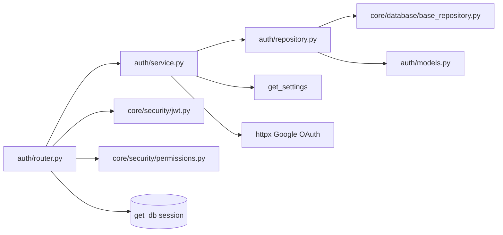

| From | Imports | Why |
|------|---------|-----|
| `auth/router.py` | `AuthService` | Business operations |
| `auth/router.py` | `get_db` | Session dependency |
| `auth/router.py` | `optional_auth`, `create_access_token` | Cookie/Bearer + JWT issue |
| `auth/router.py` | `ApiResponse`, schemas, exceptions | HTTP envelope |
| `auth/service.py` | `UserRepository` | Persistence |
| `auth/service.py` | `get_settings`, httpx, tenacity | Google token/userinfo |
| `auth/repository.py` | `User`, `BaseRepository` | Soft-delete CRUD |
| `auth/models.py` | `Base` + mixins | ORM table |
| `auth/exceptions.py` | `WandrError` subclasses | Domain errors |

**Do not:** import `UserRepository` from the router. Router → Service → Repository only.

---

## Geo gateways

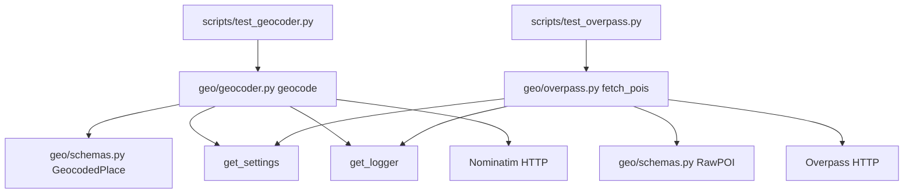

| From | Imports | Why |
|------|---------|-----|
| `geo/geocoder.py` | `get_settings`, `get_logger`, `GeocodedPlace` | Config, logs, DTO |
| `geo/overpass.py` | `get_settings`, `get_logger`, `RawPOI` | Config, logs, DTO |
| `geo/schemas.py` | pydantic only | No FastAPI / SQLAlchemy |
| `scripts/seed_destination.py`, `destinations/service.py` | `geocode` / `fetch_pois` only | Never raw OverpassQL or Nominatim URLs outside `geo/` |
| Callers needing driving times | `geo/osrm.get_route` | Haversine × 1.4 fallback; never raises httpx |

---

## Seed pipeline (P2.4)

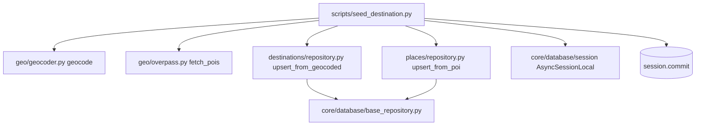

| From | Imports | Why |
|------|---------|-----|
| `scripts/seed_destination.py` | `geocode`, `fetch_pois` | Only sanctioned outbound geo path |
| `scripts/seed_destination.py` | `DestinationRepository`, `PlaceRepository` | Atomic upserts (`ON CONFLICT`) |
| `scripts/seed_destination.py` | `AsyncSessionLocal`, `dispose_engine` | Owns the session; scripts commit |
| `scripts/seed_destination.py` | `configure_logging`, `get_logger` | `seed.poi_failed` / `seed.no_pois` warnings |

Contract worth knowing before you touch it: each POI upsert runs inside `session.begin_nested()`
(a SAVEPOINT), so one failing row is rolled back and skipped while the rest of the batch and the
final commit still succeed. A bare `try/except` would leave the Postgres transaction aborted.

`seed_places(session, destination_id, pois) -> int` and
`seed_destination_into(session, name, radius_km)` are importable on purpose —
pytest drives failure boundaries without the CLI owning the session. The CLI
wrapper (`seed_destination`) still opens `AsyncSessionLocal`, commits, and
returns exit codes.

---

## Destination search + readiness (P2.6c / 2.8)

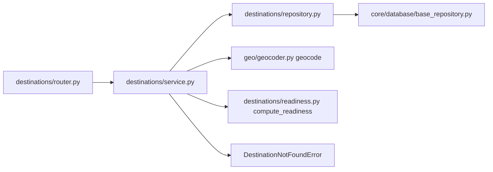

DB hit returns early and never calls Nominatim; only a miss geocodes, upserts atomically, and
commits. Readiness is pure math over denormalized counters; `search_available` is the live
`is_qdrant_available()` flag (P3.6), not permanently False.

---

## Places HTTP (P2.7b)

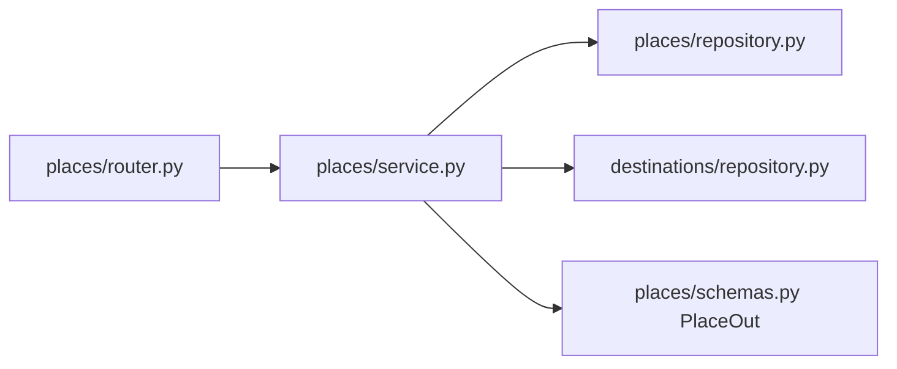

List verifies the destination exists first (404, never empty page). Router never touches repositories.
`PlaceService.enrich_place` (P3) writes `enriched_tags` via the LLM gateway — still Router→Service→Repo for HTTP.

---

## Search + enrich / index (P3)

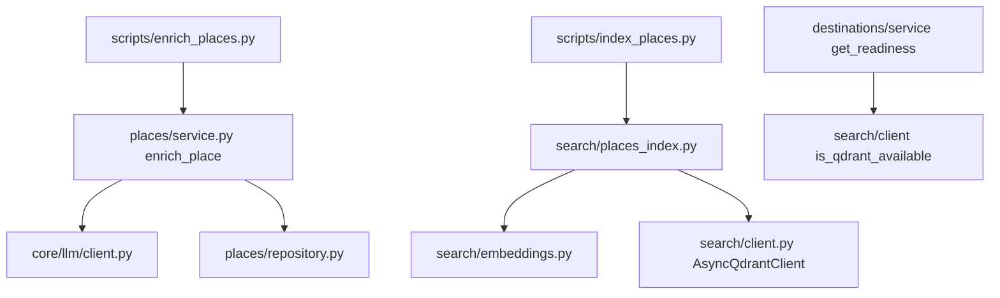

| From | Imports | Why |
|------|---------|-----|
| `search/client.py` | `get_settings`, Qdrant async client | Fail-soft collection ensure |
| `search/embeddings.py` | sentence-transformers via lifespan | `embed_text` / `embed_batch` off event loop |
| `search/places_index.py` | client + embeddings | Destination-scoped upsert / search |
| Enrich/index scripts | services / search modules | Batch CLIs; savepoint per item where needed |

---

## Travel engine + planner envelope (P4)

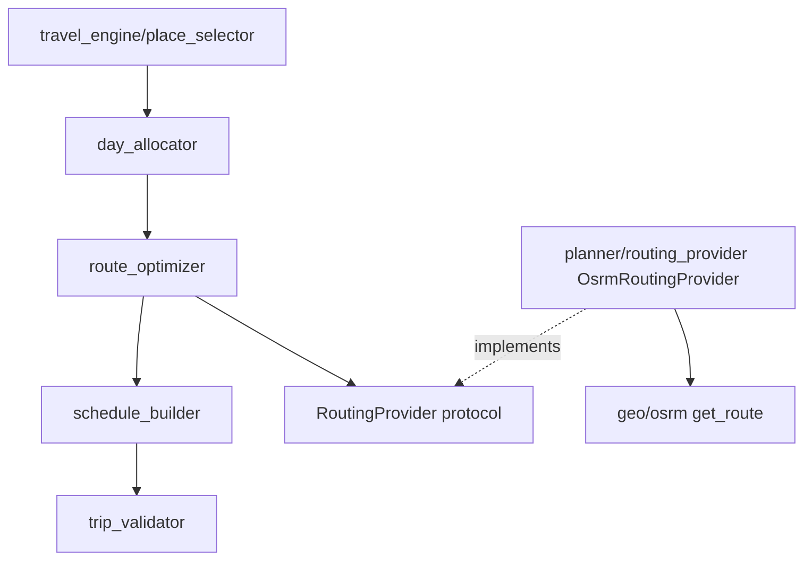

| From | Imports | Why |
|------|---------|-----|
| `travel_engine/*` | each other + `protocols` / `travel_rules` only | **No** geo / DB / LLM imports |
| `route_optimizer` | `RoutingProvider` protocol | Times injected by caller |
| `OsrmRoutingProvider` | `geo/osrm.get_route` → `RouteLeg` | Adapter at planner boundary |

`scripts/test_p4_smoke.py` drives the pure pipeline with a Fake routing provider (optional live OSRM).

---

## Planner tool loop + graph (P5)

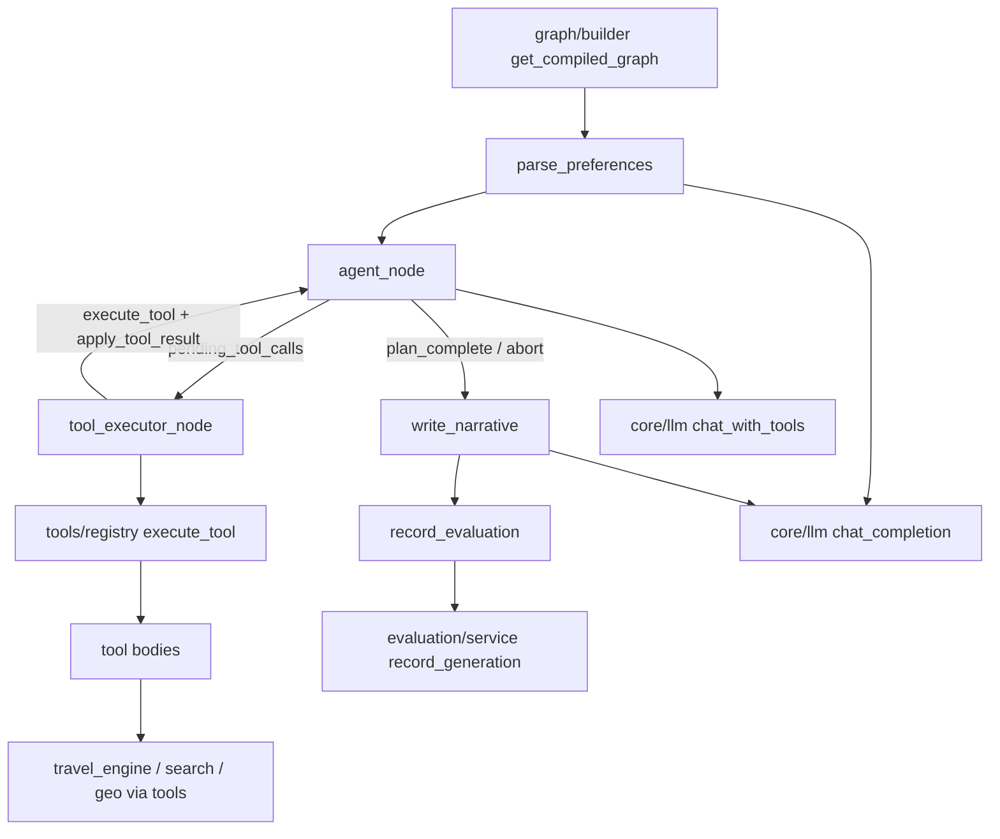

| From | Imports | Why |
|------|---------|-----|
| `agent_node` | `chat_with_tools`, `build_agent_messages`, `PHASE_TOOLS` | Decides tools only — **never** `execute_tool` |
| `tool_executor_node` | `execute_tool`, `apply_tool_result`, stuck-detector | Sole tool runner; optional `emit` for SSE |
| `execute_tool` | `TOOL_REGISTRY` + phase/precondition gates | Typed contracts; tools return `ToolResult` only |
| `apply_tool_result` | orchestration sole writer | Tools never mutate `TravelState` |
| Graph nodes | `ToolContext` from `config["configurable"]` | Cached compiled graph shared across requests |
| `record_evaluation` | `EvaluationService` | Best-effort persist; warning on DB fail |
| `builder` | LangGraph compile singleton | agent→executor unconditional; bookends on complete |

Clarification exit ends at END **without** graph `record_evaluation`; `PlannerService` still records after invoke/timeout.

---

## Planner SSE generate + cache (P6.2 / 6.4)

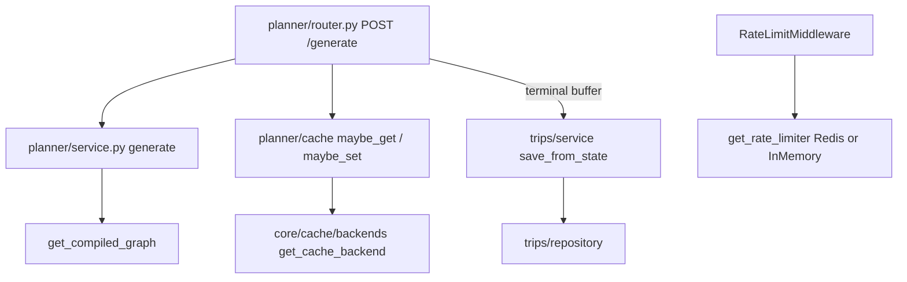

| From | Imports | Why |
|------|---------|-----|
| `planner/router.py` | `PlannerService`, `PlanRequest`, trips `save_from_state` | SSE stream + terminal persist + `trip_id` |
| `planner/cache.py` | `get_cache_backend()`, settings TTL | MVP cache hit still feeds `save_from_state` (new trip) |
| `core/cache/backends.py` | `REDIS_URL` via `get_settings()` | Empty → `InMemoryCacheBackend` |
| `core/middleware/rate_limit.py` | `get_rate_limiter()` | Redis when `REDIS_URL` set; else in-memory; fail-open |

Proxy must disable response buffering for `/api/v1/planner/generate`. Clients: POST `fetch()` + manual SSE parse — not `EventSource`.

---

## Trips HTTP (P6.1–6.3) + day edits (P7)

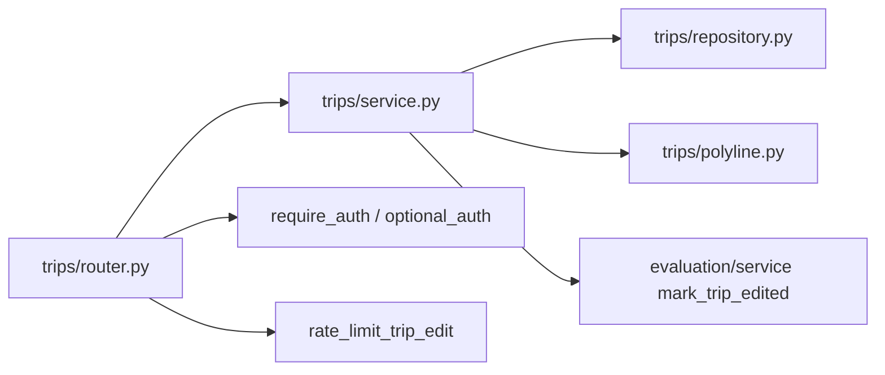

| From | Imports | Why |
|------|---------|-----|
| `trips/router.py` | `TripService` helpers | list/get/delete/geojson/claim + reorder/remove/add/reoptimize |
| `trips/dependencies.py` | `get_rate_limiter()` | User-keyed `{user_id}:trip_edit`; fail-open |
| `trips/service.py` | `TripRepository`, ownership, `build_geojson`, routing provider | Day surgery UoW + TripEditEvent; no `PlannerService` import |
| `trips/polyline.py` | pure decode | Invalid encoded string → `[]` |

Ownership: guest session or owner for GET; DELETE requires auth; claim matches `wandr_session` + unclaimed. Edit routes require owner + `rate_limit_trip_edit`.

---

## Observability (V2 Langfuse)

| From | Imports | Why |
|------|---------|-----|
| `planner/service.py` | `start_generation_trace` / `emit_tool_spans_from_trace` / `end_generation_trace` | One parent trace per generate; finally always ends |
| `core/llm/client.py` | `safe_generation_span` | Per-call generation spans + token usage |
| `main.py` lifespan | `flush_tracer()` | Shutdown flush |
| Empty `LANGFUSE_PUBLIC_KEY` / `LANGFUSE_SECRET_KEY` | `NoOpTracer` | No network; generate unchanged |

Golden accuracy is **offline** (`scripts/run_evals.py`) — not Langfuse Datasets.

---

## Database & models

| From | Imports | Why |
|------|---------|-----|
| Domain `*/models.py` | `src.core.database.base` mixins | Shared UUID / timestamps / soft-delete |
| `alembic/env.py` | All model modules | Autogenerate / metadata |
| Repositories | models + `BaseRepository` | Typed CRUD |
| Routers needing DB | `get_db` only (via service today) | Session scope |

---

## Security helpers

| From | Imports | Why |
|------|---------|-----|
| `permissions.py` | `jwt.verify_token` | Parse Bearer / cookie |
| Routers | `require_auth` / `optional_auth` | FastAPI dependencies |
| Auth callback | `create_access_token` | Issue `wandr_token` |

---

## What is *not* wired yet

- Evaluation HTTP — generation persist + edit flag are real; no evaluation router.
- `auth/dependencies.py` — unused placeholder.
- V6.2 / V6.3 embedding bump / cross-encoder — deferred.

Planner SSE generate, trips HTTP + day edits, Redis/in-memory cache backends, and Langfuse generate wrap **are** wired — see sections above.

## P2–P7 + v7 verification wiring

| Path | Role |
|------|------|
| `tests/geo/` | Mocked Nominatim / Overpass / OSRM gateway tests |
| `tests/destinations/`, `tests/places/` | Readiness, prepare, repository, HTTP router tests |
| `tests/scripts/test_seed_destination.py` | Seed failure boundaries |
| `scripts/test_p2_smoke.py` | Live fail-fast proof |
| `tests/search/` | Qdrant / embeddings / hybrid index tests |
| `tests/travel_engine/`, `tests/planner/` | Purity + tool-loop + SSE/cache + tracing wrap |
| `tests/trips/` | Trips HTTP / ownership / claim / day edits |
| `tests/evaluation/` | Evaluation service / scorers |
| `tests/core/` | Cache backends + Redis rate limiter fail-open |
| `scripts/test_p4_smoke.py` | Offline Fake travel_engine pipeline |
| `scripts/test_agent.py` | P5 agent smoke |
| `scripts/test_p6_smoke.py` | P6 SSE + trips + cache proof |
| `scripts/test_p7_smoke.py` | P7 edit + TripEditEvent + GeoJSON |
| `scripts/run_evals.py` | Golden harness + baseline diff |

Next: [05 — How to change](05-how-to-change.md)
